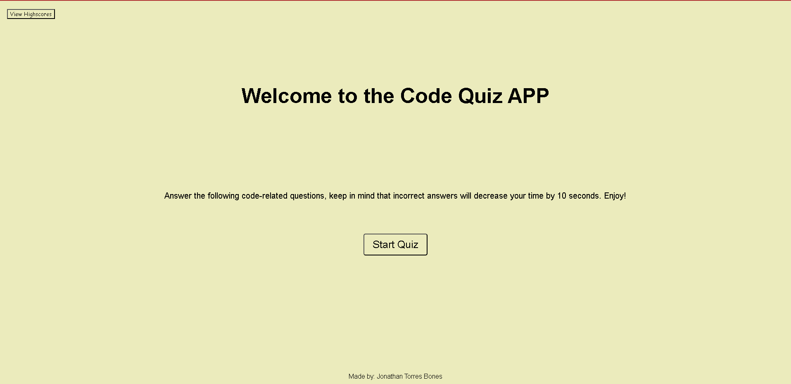

# Code Quiz App

## Description

Challenge Module 04 - Web APIs. This week I built a web code quiz from scratch using HTML, CSS and Javascript. This project made me really research, to not only figure out what the error was but to also fix the error I continued to make. I am not only proud of my work this week but this week I found a new appreciation for the process. I am really enjoying this bootcamp and I know there is still a lot to come. Enjoy testing my quiz app.

## Usage

For you to use this page first, you need to press the start quiz button. Then you begin to answer the questions by clicking on the answer you believe to be correct. Keep in mind that every wrong answer will penalize you and deductime 10 seconds from the 60 second timer that you have to answer all 5 questions. When you answer all 5 questions the page will give you your score. You have the option to save your score by inputing your initials and you also have the ability to see all the scores that were saved by pior users.  

## Screen Captures and Live Link

https://torresbones.github.io/codequiz/

## License

MIT License

Copyright (c) 2023 Jonathan Torres Bones

Permission is hereby granted, free of charge, to any person obtaining a copy
of this software and associated documentation files (the "Software"), to deal
in the Software without restriction, including without limitation the rights
to use, copy, modify, merge, publish, distribute, sublicense, and/or sell
copies of the Software, and to permit persons to whom the Software is
furnished to do so, subject to the following conditions:

The above copyright notice and this permission notice shall be included in all
copies or substantial portions of the Software.

THE SOFTWARE IS PROVIDED "AS IS", WITHOUT WARRANTY OF ANY KIND, EXPRESS OR
IMPLIED, INCLUDING BUT NOT LIMITED TO THE WARRANTIES OF MERCHANTABILITY,
FITNESS FOR A PARTICULAR PURPOSE AND NONINFRINGEMENT. IN NO EVENT SHALL THE
AUTHORS OR COPYRIGHT HOLDERS BE LIABLE FOR ANY CLAIM, DAMAGES OR OTHER
LIABILITY, WHETHER IN AN ACTION OF CONTRACT, TORT OR OTHERWISE, ARISING FROM,
OUT OF OR IN CONNECTION WITH THE SOFTWARE OR THE USE OR OTHER DEALINGS IN THE
SOFTWARE.
